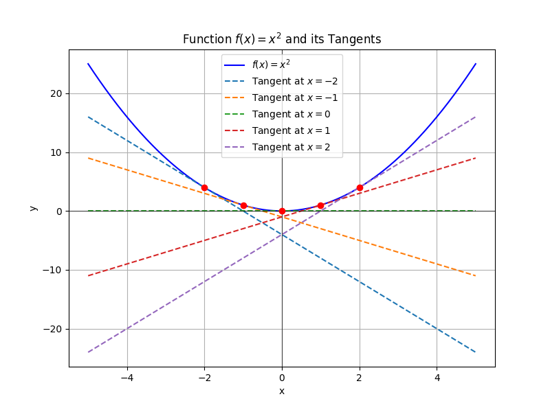

# java-kit-server

## 项目简介

**java-kit-server** 是一个基于 Java 开发并运行于 Linux 环境下的项目，旨在为开发者提供一个高效、稳定和易于扩展的平台。该项目结合了 Java 的跨平台优势和 Linux 的高性能稳定性，适用于各种服务端应用、自动化工具和企业级系统开发。

## 功能
- 执行linux命令
- 执行python脚本

## 演示视频

[演示视频](https://www.bilibili.com/video/BV1SqXNYqEi1/)

## 特性

- **跨平台支持**：利用 Java 的平台无关性，实现代码在不同操作系统中的一致性表现。
- **高性能**：在 Linux 环境下优化资源管理与调度，确保应用高效运行。
- **易于扩展**：模块化设计，方便添加新功能和集成第三方组件。
- **稳定可靠**：依托 Linux 强大的系统内核和社区支持，保障系统稳定性与安全性。

## 环境要求

- **操作系统**：Linux（推荐使用 Ubuntu、CentOS 或其他主流发行版）
- **Java 版本**：Java 8 或更高版本
- **依赖工具**：Git、Maven/Gradle（根据项目构建工具选择）

## 安装步骤

1. **克隆仓库**  
   打开终端并运行以下命令将项目克隆到本地：
   ```bash
   git clone https://github.com/litongjava/java-kit-server.git
   ```
2. **编译项目**  
   进入项目目录，根据使用的构建工具进行编译。例如，如果使用 Maven：
   ```bash
   cd java-kit-server
   mvn clean package -DskipTests -Pproduction -q
   ```
3. **运行应用**  
   编译完成后，运行生成的 jar 包：
   ```bash
   java -jar target/java-kit-server-1.0.0.jar
   ```

## 使用说明

在成功启动应用后，你可以通过以下方式进行访问和配置：

- **配置文件**：所有配置均在 `config` 目录下进行管理，根据不同环境进行相应调整。
- **日志文件**：运行日志保存在 `logs` 目录中，便于进行问题排查和性能监控。
- **接口调用**：项目提供 RESTful 接口，可通过 Postman 或浏览器进行测试，详细接口文档请参见 [API 文档](docs/API.md)。
## 接口
```curl
curl --location --request POST 'http://127.0.0.1/python' \
--header 'User-Agent: Apifox/1.0.0 (https://apifox.com)' \
--header 'Authorization: Bearer 123456' \
--header 'Content-Type: text/plain' \
--header 'Accept: */*' \
--header 'Host: 127.0.0.1' \
--header 'Connection: keep-alive' \
--data-raw 'import numpy as np
import matplotlib.pyplot as plt

# 定义函数 f(x) = x^2
def f(x):
    return x**2

# 定义切线方程
def tangent_line(a, x):
    return 2*a*x - a**2

# 生成 x 数据
x = np.linspace(-5, 5, 400)
y = f(x)

# 选取多个切点
a_values = [-2, -1, 0, 1, 2]

# 绘图
plt.figure(figsize=(8, 6))
plt.plot(x, y, label=r'\''$f(x) = x^2$'\'', color="blue")

# 绘制每个切点的切线
for a in a_values:
    tangent_y = tangent_line(a, x)
    plt.plot(x, tangent_y, '\''--'\'', label=fr'\''Tangent at $x={a}$'\'')

    # 标记切点
    plt.scatter(a, f(a), color='\''red'\'', zorder=3)

# 设置图表属性
plt.xlabel('\''x'\'')
plt.ylabel('\''y'\'')
plt.title('\''Function $f(x) = x^2$ and its Tangents'\'')
plt.axhline(0, color='\''black'\'', linewidth=0.5)
plt.axvline(0, color='\''black'\'', linewidth=0.5)
plt.legend()
plt.grid(True)

# 显示图形
plt.show()'
```


## 安装的python库
- **numpy**：用于高效的多维数组和矩阵运算，是数值计算的基础包。  
- **matplotlib**：一个强大的绘图库，能够生成高质量的图形和可视化结果。  
- **pandas**：主要用于数据处理和分析，提供了高效的数据结构（如 DataFrame）和数据操作工具。  
- **scipy**：基于 numpy，提供了更多的科学计算工具，如积分、优化、信号处理等。  
- **seaborn**：基于 matplotlib，提供更高级、更美观的数据可视化接口，适合统计图表绘制。  
- **scikit-learn**：机器学习库，包含了大量常用的机器学习算法和数据预处理工具。  
- **statsmodels**：用于统计建模和计量经济学分析，适合需要详细统计检验和模型诊断的场景。  
- **requests**：简化 HTTP 请求的库，用于网络数据获取。  
## 贡献指南

我们欢迎社区贡献！如果你有好的想法或发现了问题，请按照以下流程提交 PR：

1. Fork 仓库并新建分支；
2. 实现新功能或修复 Bug；
3. 提交 PR 并描述详细修改内容；
4. 等待项目维护者审核和反馈。

## 许可证

本项目采用 [MIT License](LICENSE) 许可证，详情请参见 LICENSE 文件。